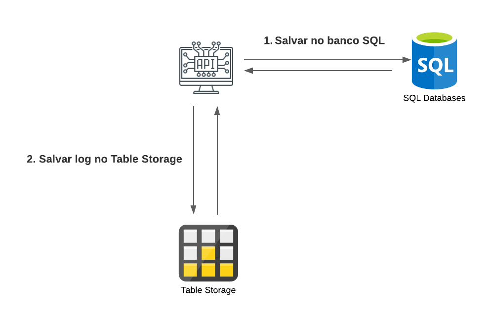

# RH Cadastro e deploy na Nuvem com Microsoft Azure  ::cloud:


## Desafio de projeto
Usar seus conhecimentos adquiridos no módulo de Nuvem com Microsoft Azure, da trilha .NET da DIO.

## Contexto
Construir um sistema de RH, onde para essa versão inicial do sistema o usuário poderá cadastrar os funcionários de uma empresa. 

Possui um CRUD, ou seja, permite obter os registros, criar, salvar e deletar esses registros. A aplicação também precisa armazena logs de toda e qualquer alteração que venha a ocorrer com um funcionário.

## Premissas
A classe Funcionario e a FuncionarioLog atende o seguinte:


A classe FuncionarioLog é filha da classe Funcionario, pois o log tem as mesmas informações da Funcionario.

O projeto possui a migration espelhamento dos Modelos no banco de dados.

## Métodos esperados


**Swagger**


**Endpoints**


| Verbo  | Endpoint                | Parâmetro | Body               |
|--------|-------------------------|-----------|--------------------|
| GET    | /Funcionario/{id}       | id        | N/A                |
| PUT    | /Funcionario/{id}       | id        | Schema Funcionario |
| DELETE | /Funcionario/{id}       | id        | N/A                |
| POST   | /Funcionario            | N/A       | Schema Funcionario |

Esse é o schema (model) de Funcionario, utilizado para passar para os métodos que exigirem:

```json
{
  "nome": "Nome funcionario",
  "endereco": "Rua 1234",
  "ramal": "1234",
  "emailProfissional": "email@email.com",
  "departamento": "TI",
  "salario": 1000,
  "dataAdmissao": "2022-06-23T02:58:36.345Z"
}
```

## Ambiente



**Agradecimentos**

 ao Professor **Leonardo Buta** pelos grandes ensinamentos adquiridos nessa formação C# e .NET Developer.